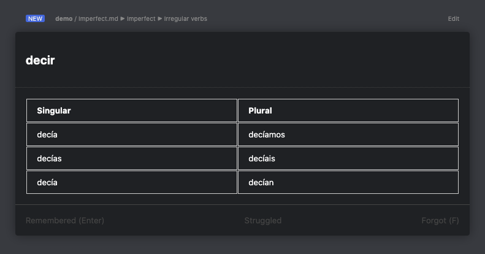

# Introduction

**Recall** is an extension of Microsoft's Visual Studio Code to help you remember stuff using [spaced repetition](https://en.wikipedia.org/wiki/Spaced_repetition).

It creates flashcards directly from your Markdown notes and let's you test yourself repeatedly to maximize your memory retention. This can be usefull when learning a new language, taking a course on a particular subject, remembering jokes or pretty much anything else you want to remember. The choice is yours 😉

Want to learn more? You can check the [documentation site](https://recall.frenya.net).



# How does it work?

Write your notes in Markdown and store them in .md files.
**Recall** will scan your workspace folders, identify possible "flashcards" and test you using spaced repetition.

Notes:

- To see your note rendered as HTML, simply use the Markdown Preview functionality of VS Code.
- For more information on Markdown, please visit [Markdown Guide](https://www.markdownguide.org/).

## How are flashcards identified

**Recall** scans all the .md files in you workspace and identifies flashcards using the following algorithm

- at header level
  - any header marks a start of a new flashcard
  - any blank line marks a start of a new page (of that flashcard)
- at bullet point level (when enabled)
  - any first level bullet point with of the configured type is a start of a new card
  - the bullet point is split using the line divider string (e.g. ::), configurable
  - the newline at the end of the bullet point also serves as a page divider
- if a flashcard has at least two pages, it will be put in the testing queue

To better understand the above, look at the practical examples in the [demo folder](https://github.com/frenya/vscode-recall/tree/master/demo).

For example, the above screenshot comes from this paragraph

```markdown
### decir

|Singular|Plural  |
|--------|--------|
|decía   |decíamos|
|decías  |decíais |
|decía   |decían  |
```

Note: If you want to prevent a page break, put a single space on the line. Make sure you have the `files.trimTrailingWhitespace` set to `false`,
otherwise it will get removed when saving the file.

## Testing yourself

To really train your memory, you should do a daily review of your cards. To run it, simply run the "Recall: Flashcards Test" command in VSCode
(easiest way is to press `Ctrl-P` to see list of commands and start typing the name).

A webview will appear show you the first page of the first card to review. You then have the following options/hotkeys:

- `Space` - expands the card and shows one more page (repeat until the card is fully expanded)
- `Enter` - mark the card as remembered
- `F` - mark the card as forgotten
- `N` - go to the next card without logging any result
- `A` - archive card - card won't show for review anymore

## **Recall** level

Every card has a so called "recall level" which indicates how well you remember it. It also represents the number of days after which it
will be queued for review again.

All cards start with a default recall level of 1 which means the card will be queued for review the next day. If you mark it as remembered,
the recall level will be doubled. If you mark it as forgotten, the recall level will be halved.

# Configuration

You can find the configuration options in Settings (Extensions -> Recall). Pay extra attention to these configuration options

- Default Level - defines at which level to detect flashcards
  - **ignore** - no detection will be done
  - **header** - any header starts a new card
  - **bullet** - any "-" bullet starts a new card (as well as a header)
  - **asterisk** - any "*" bullet starts a new card (as well as a header)
- Line Divider - delimiter used in single line cards (use any string that works for you - colon, semicolon, slash, etc.), can even be multi-character sequence
- New Card Limit - defines the maximum number of new cards allowed in one review session
  - defaults to 0, i.e. unlimited
  - you can use it to better pace the learning, e.g. when you add a large number of new cards at the same time
- Hide badges - as card are detected in the text, the editor adds a small badge with the card's state (NEW, GOOD, HARD, etc.) depending on the review results. This setting gives you the option to hide certain states if you wish, or even all of them.

If you need to override the default level of card recognition for a particular file, you can use the YAML header.

For example, to tell **Recall** that individual bullets should be recognized in the file, simply add the following sequence at the beginning of your .md file.

```yaml
---
recall: bullet
---
```

# Import from Mochi

To import export files from Mochi, you can run the Recall: Convert Mochi archive command, select a .mochi archive and for every deck in it
a separate new Markdown file will be created. You can then save it anywhere you want.

If your Mochi deck contains media files (e.g. pictures), they will not be extracted. To extract them, simply unzip the .mochi file into a `media` subfolder
and correct the links in the Markdown files accordingly. You can find all the links easily by searching for "@media".

In certain cases, the import fails. This is due to a bug in the EDN parser library and would be difficult to correct. As a workaround, it is possible to
unzip the .mochi file, convert the data.edn file to JSON using [this tool](http://repo.tiye.me/mvc-works/edn-formatter/), open the JSON file in VSCode and
run the "Recall: Convert Mochi JSON" command.

# Support

- File bugs, feature requests in [GitHub Issues](https://github.com/frenya/vscode-recall/issues)
- Leave a review on [Visual Studio Marketplace](https://marketplace.visualstudio.com/items?itemName=frenya.vscode-recall)
- Check out my [other extensions](https://marketplace.visualstudio.com/publishers/frenya)
- If you like this extension and want to support it's further development, you can [Buy Me a Coffee](https://www.buymeacoffee.com/frenya)


<!-- a href="https://www.buymeacoffee.com/frenya" target="_blank">
  
</a -->

# Credits

Some concepts of this extension were inspired by the [Mochi](https://mochi.cards/) application.
Go ahead and check it out. You may find it more suitable to your needs.

Please note that I am not associated with that project in any way.
